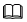

# Average Threshold-Based Slow Drive Detection Plugin

Users can perform slow drive fault detection through the average threshold-based slow drive detection plugin. When the plugin detects a slow drive in the system, it reports the result to the `xalarmd` service, users can view alarm results by subscribing to alarms or running the `get_alarm` command. For details about alarm subscription and the `get_alarm` command, see [Installation and Usage](./installation_and_usage.md).

## Usage Restrictions

1. The average threshold-based slow drive detection plugin can detect the following slow drives:
   - Slow drives due to I/O pressure: The alarm log contains keyword `IO press`.
   - Slow drives due to drive faults: The alarm log contains keyword `driver slow`.
   - Slow drives due to I/O stack anomalies: The alarm log contains keyword `kernel slow`.
   - Slow drives due to unknown reasons: The alarm log contains keyword `unknown`.
2. The performance overhead (including CPU utilization, memory usage, and I/O throughput) of the average threshold-based slow drive detection plugin during operation does not exceed 5% of the total environment capacity.
3. The detection rate and accuracy of the average threshold-based slow drive detection plugin are both over 80%.
4. Only the openEuler-20.03-LTS-SP4 version is supported, and the 4.19.90 kernel is used.
5. Slow drive detection can be performed only for `nvme-ssd`, `sata-ssd`, and `sata-hdd` drives. For details about how to identify drive types, see [FAQs - Question 2](./question_and_answer.md#question-2-how-do-i-identify-the-types-of-drives-in-the-system).
6. Before starting the average threshold inspection, ensure that the `sysSentry`, `xalarmd`, and `sentryCollector` services are running.

## Installing the Plugin

### Prerequisites

The `sysSentry` inspection plugin has been installed, and I/O-related collection items have been configured for the `sentryCollector` collection service. For details about how to configure the collection items, see [Installation and Usage](./installation_and_usage.md).

### Installing the Software Package

```shell
[root@openEuler ~]# yum install -y avg_block_io pysentry_notify pysentry_collect
```

### Adding avg_block_io to the Framework for Management

```shell
[root@openEuler ~]# sentryctl reload avg_block_io
```

## Configuration File Description

The configuration file of the `avg_block_io` plugin is stored in `/etc/sysSentry/plugins/avg_block_io.ini`. Modifications to the configuration file take effect upon the next startup of the inspection task.

| Section              | Parameter          | Description                                                  | Default Value    | Mandatory or Not|
| -------------------- | ---------------- | ------------------------------------------------------------ | ---------- | ------ |
| [log]                | level            | Log level. The value can be `debug`, `info`, `warning`, `error`, or `critical`. If the value is not configured or is invalid, the default value is used.| info       | Y      |
| [common]             | disk             | Drive names, separated by commas (,). Value `default` indicates all drives in the current environment. If the configuration is incorrect, only the correct fields are retained.| default    | Y      |
| [common]             | stage            | Monitoring stages, separated by commas (,). Currently, the following nine stages are supported: `throtl`, `wbt`, `gettag`, `plug`, `deadline`, `hctx`, `requeue`, `rq_driver`, and `bio`. The stages provided may vary depending on the drive type. Value `default` indicates all phases supported by the drive. If this parameter is not configured, the default configuration is used. If the configuration is incorrect, an error is reported and the process exits. Note: The `bio` stage must be included in manual configurations.| default    | Y      |
| [common]             | iotype           | I/O types, separated by commas (,). Two types are supported: `read` and `write`. If this parameter is not configured, the default configuration is used. If the configuration is incorrect, an error is reported and the process exits.| read,write | Y      |
| [common]             | period_time      | Inspection interval of the plugin. The value is an integer, in seconds. The value must be an integer multiple of the `sentryCollector` collection interval and cannot exceed the value of `max_save` of `sentryCollector`. For details, see the `sentryCollector` configuration file.| 1          | Y      |
| [algorithm]          | win_size         | Window length of the average threshold algorithm. The value is an integer. A larger value leads to more stable algorithm statistical results. The value ranges from `win_threshold` to 300. If this parameter is not configured, the default configuration is used. If the configuration is incorrect, an error is reported and the process exits.| 30         | Y      |
| [algorithm]          | win_threshold    | Number of threshold breaches for the average threshold algorithm. The value is an integer. A smaller value results in faster anomaly reporting but a higher false positive rate. The value ranges from 1 to `win_size`. If this parameter is not configured, the default configuration is used. If the configuration is incorrect, an error is reported and the process exits.| 6          | Y      |
| [latency_\<DISK_TYPE>]  | read_avg_lim     | Upper limit of the average read latency, in us. This parameter indicates the limit on the average read I/O latency in the window. A larger value results in a higher false negative rate of the algorithm. If this parameter is not configured, the default configuration is used. If the configuration is incorrect, an error is reported and the process exits.| -          | Y      |
| [latency_\<DISK_TYPE>]  | write_avg_lim    | Upper limit of the average write latency, in us. This parameter indicates the limit on the average write I/O latency in the window. A larger value results in a higher false negative rate of the algorithm. If this parameter is not configured, the default configuration is used. If the configuration is incorrect, an error is reported and the process exits.| -          | Y      |
| [latency_\<DISK_TYPE>]  | read_avg_time    | Read latency multiplier. The value is an integer. This parameter indicates the multiple of `read_avg_lim` beyond which read latency is identified as anomalous. A larger value results in a higher false negative rate of the algorithm. If this parameter is not configured, the default configuration is used. If the configuration is incorrect, an error is reported and the process exits.| -          | Y      |
| [latency_\<DISK_TYPE>]  | write_avg_time   | Write latency multiplier. The value is an integer. This parameter indicates the multiple of `write_avg_lim` beyond which write latency is identified as anomalous. A larger value results in a higher false negative rate of the algorithm. If this parameter is not configured, the default configuration is used. If the configuration is incorrect, an error is reported and the process exits.| -          | Y      |
| [latency_\<DISK_TYPE>]  | read_tot_lim     | Absolute upper limit for read latency, in us. Any read latency above this upper limit is identified as anomalous. A larger value results in a higher false negative rate of the algorithm. If this parameter is not configured, the default configuration is used. If the configuration is incorrect, an error is reported and the process exits.| -          | Y      |
| [latency_\<DISK_TYPE>]  | write_tot_lim    | Absolute upper limit for write latency, in us. Any write latency above this upper limit is identified as anomalous. A larger value results in a higher false negative rate of the algorithm. If this parameter is not configured, the default configuration is used. If the configuration is incorrect, an error is reported and the process exits.| -          | Y      |
| [iodump]             | read_iodump_lim  | Absolute upper limit for read `iodump`. The value is an integer. Any read `iodump` count above this upper limit is identified as anomalous. A larger value results in a higher false negative rate of the algorithm. If this parameter is not configured, the default configuration is used. If the configuration is incorrect, an error is reported and the process exits.| 0          | Y      |
| [iodump]             | write_iodump_lim | Absolute upper limit for write `iodump`. The value is an integer. Any write `iodump` count above this upper limit is identified as anomalous. A larger value results in a higher false negative rate of the algorithm. If this parameter is not configured, the default configuration is used. If the configuration is incorrect, an error is reported and the process exits.| 0          | Y      |
| [\<stage>_\<DISK_TYPE>] | read_avg_lim     | Upper limit of the average read latency in a specified stage, in us. This parameter indicates the limit on the average read I/O latency in the window. A larger value results in a higher false negative rate of the algorithm. If this parameter is not configured, the default configuration is used. If the configuration is incorrect, an error is reported and the process exits.| -          | N      |
| [\<stage>_\<DISK_TYPE>] | read_tot_lim     | Absolute upper limit for read latency in a specified stage, in us. Any read latency above this upper limit is identified as anomalous. A larger value results in a higher false negative rate of the algorithm. If this parameter is not configured, the default configuration is used. If the configuration is incorrect, an error is reported and the process exits.| -          | N      |

>**NOTE:**
>
>1. Adjusting any parameters in the `latency_\<DISK_TYPE>`, `iodump`, or `\<stage>_\<DISK_TYPE>` configuration section will affect the accuracy of the algorithm. A larger value results in a higher false negative rate, while a smaller value results in a higher false positive rate. You need to make choices based on experience.
>2. `\<DISK_TYPE>` indicates the drive type. Currently, only three types are supported: `sata_ssd`, `nvme_ssd`, and `sata_hdd`.
>3. The `stage` in `\<stage>\_\<DISK_TYPE>` can be any stage supported by the `common.stage` parameter. This section is optional. If it is configured, its parameters take precedence during fault detection for the corresponding stage, overriding those defined in `latency_\<DISK_TYPE>` or `iodump`.

## Using the Average Threshold-Based Slow Drive Detection Plugin

1. Start an inspection.

   ```shell
   [root@openEuler ~]# sentryctl start avg_block_io
   ```

2. Check the status of the inspection plugin.

   ```shell
   [root@openEuler ~]# sentryctl status avg_block_io
   ```

   If the status is `RUNNING`, the plugin is running. If the status is `EXITED`, the plugin has exited.

3. View alarm information.

   ```shell
   [root@openEuler ~]# sentryctl get_alarm avg_block_io -s 1 -d
   ```

   Example:

   ```shell
    [
        {
            "alarm_id": 1002,
            "alarm_type": "ALARM_TYPE_OCCUR",
            "alarm_level": "MINOR_ALM",
            "timestamp": "2024-10-23 11:56:51",
            "alarm_info": {
                "alarm_source": "avg_block_io",
                "driver_name": "sda",
                "io_type": "write",
                "reason": "IO press",
                "block_stack": "bio,wbt",
                "alarm_type": "latency",
                "details": {
                    "latency": "gettag: [0,0,0,0,0,0,0,0,0,0,0,0,0,0,0,0,0,0,0,0,0,0,0,0,0,0,0,0,0,0], rq_driver: [0,0,0,0,0,437.9,0,0,0,0,517,0,0,0,0,0,0,0,0,0,0,0,0,0,0,0,0,0,0,0], bio: [0,0,0,0,0,521.1,0,0,0,0,557.8,0,0,0,0,0,0,0,0,0,0,0,0,0,0,0,0,0,0,0], wbt: [0,0,0,0,0,0,8.5,0,0,0,0,12.0,0,0,0,0,0,0,0,0,0,0,0,0,0,0,0,0,0,0]",
                    "iodump": "gettag: [0,0,0,0,0,0,0,0,0,0,0,0,0,0,0,0,0,0,0,0,0,0,0,0,0,0,0,0,0,0], rq_driver: [0,0,0,0,0,0,0,0,0,0,0,0,0,0,0,0,0,0,0,0,0,0,0,0,0,0,0,0,0,0], bio: [0,0,0,0,0,0,0,0,0,0,0,0,0,0,0,0,0,0,0,0,0,0,0,0,0,0,0,0,0,0], wbt: [0,0,0,0,0,0,0,0,0,0,0,0,0,0,0,0,0,0,0,0,0,0,0,0,0,0,0,0,0,0]"
                }
            }
        }
    ]
    ```

   The fields in the output are described as follows:

   | Field| Description|
   | --- | --- |
   | alarm_id | ID of the alarm reported by the user. For the average threshold-based slow drive detection plugin, the ID is fixed at `1002`.|
   | alarm_type | Alarm type. The alarm type of the average threshold-based slow drive detection plugin is `ALARM_TYPE_OCCUR`, indicating that an alarm is generated.|
   | alarm_level | Alarm severity. The alarm severity of the average threshold-based slow drive detection plugin is `MINOR_ALM`, indicating that the system is abnormal and has attempted to rectify the fault through automatic isolation.|
   | timestamp | Alarm report time.|
   | alarm_info | Alarm details, which is customized by the average threshold-based slow drive detection plugin. The content reported by different inspection plugins is different.|

   The fields in `alarm_info` are described as follows:

   | Fields in alarm_info| Description|
   | --- | --- |
   | alarm_source | Alarm plugin name. For the average threshold-based slow drive detection plugin, the value is fixed at `avg_block_io`.|
   | driver_name | Name of the drive for which the alarm is generated, for example, `sda`.|
   | io_type | I/O type of the alarm. The value can be:<br>1. `read`: slow drive fault alarm for read I/Os.<br>2. `write`: slow drive fault alarm for write I/Os.|
   | reason | Alarm cause. The average threshold-based slow drive detection plugin may have the following four alarm causes:<br>1. `IO press`: slow drive alarm caused by high I/O pressure.<br>2. `driver slow`: slow drive alarm caused by drive faults.<br>3. `kernel slow`: slow drive alarm caused by I/O stack exceptions.<br>4. `unknown`: slow drive alarm caused by unknown faults.|
   | block_stack | Stage where the slow I/O exception occurs. This can be a combination of the following stages: `bio`, `throtl`, `wbt`, `rq_driver`, `gettag`, `plug`, `deadline`, `hctx`, and `requeue`. For detailed descriptions of these stages, see [Secondary Development Guide - Plugin Event Alarm Reporting](./developer_guide.md#reporting-plugin-event-alarms).|
   | details | Information recorded in the alarm log, which is displayed only when the `get_alarm` command is executed with the `-d` or `--detailed` option. The information includes the `latency` (I/O latency data) and `iodump` (number of I/Os that time out and are not completed) of the abnormal drive.|

4. Stop the inspection.

   ```shell
   sentryctl stop avg_block_io
   ```

5. View inspection results.
   After the inspection is complete, run the following command to view the inspection result:

   ```shell
   sentryctl get_result avg_block_io
   ```

   The command output is in JSON format. The content format is as follows:

   ```ini
   {
       "result": "PASS",
       "start_time": "YYYY-mm-DD HH:MM:SS",
       "end_time": "YYYY-mm-DD HH:MM:SS",
       "error_msg" : "",
       "details":{}  #The details information in the average threshold algorithm is empty.
   }
   ```

   The mapping between `result` and `error_msg` is as follows:

   | result | Corresponding error_msg Information| Description|
   | ------ | --------------- | -------- |
   | PASS         | ""                                                           | The inspection task is complete and no exception occurs.|
   | SKIP         | "not supported.maybe some rpm package not be installed."     | The inspection task is skipped or not executed due to reasons such as dependency missing or environment not supported.|
   | FAIL         | "FAILED. config may be incorrect or the command may be invalid/killed!" | The inspection task fails to be executed due to reasons such as command execution errors.|
   | MINOR_ALM    | "the command output shows that the status is 'INFO' or 'GENERAL_WARN'." | The inspection task is complete. The system is abnormal, and the fault has been automatically rectified by means such as automatic isolation.|
   | MAJOR_ALM    | "the command output shows that the status is 'WARN' or 'IMPORTANT_WARN'." | The inspection task is complete. The system is abnormal and needs to be rectified by means such as restart.|
   | CRITICAL_ALM | "the command output shows that the status is 'FAIL' or 'EMERGENCY_WARN'." | The inspection task is complete. A critical alarm is generated. The system or hardware encounters an unrecoverable fault. You are advised to replace the system or hardware.|
