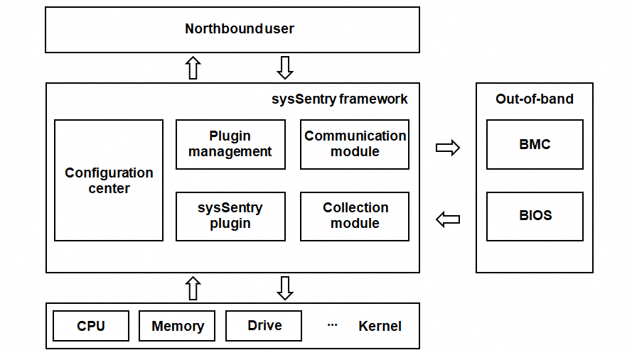

# sysSentry Introduction

 `sysSentry` provides a fault inspection framework. By offering a unified northbound fault reporting interface and southbound plugins that support various inspection and diagnostic capabilities, the framework enables the inspection and diagnosis of hardware faults across CPUs, memory, drives, NPUs, and other components.
 

   sysSentry features the following functions:

1. **Unified alarm/event notification service**: Receives fault information reported by various plugins and forwards the information in a unified manner. This enables different subscriber services to receive specific fault notifications tailored to their operational needs.
2. **Unified log service**: Aggregates and records fault information from all plugins, improving fault location efficiency.
3. **Fault diagnosis/inspection framework**: Supports the development and configuration of inspection and diagnostic tasks via a pluggable architecture. It allows plugins written in C/C++, Python, or Shell to be managed independently, including start/stop operations and status or result queries.
4. **Lightweight data collection service**: Retrieves hardware status information via kernel, BIOS, and BMC interfaces for analysis and use by various plugins. It is designed for high adaptability, supporting a wide range of underlying architectures, software versions, and data collection requirements.
