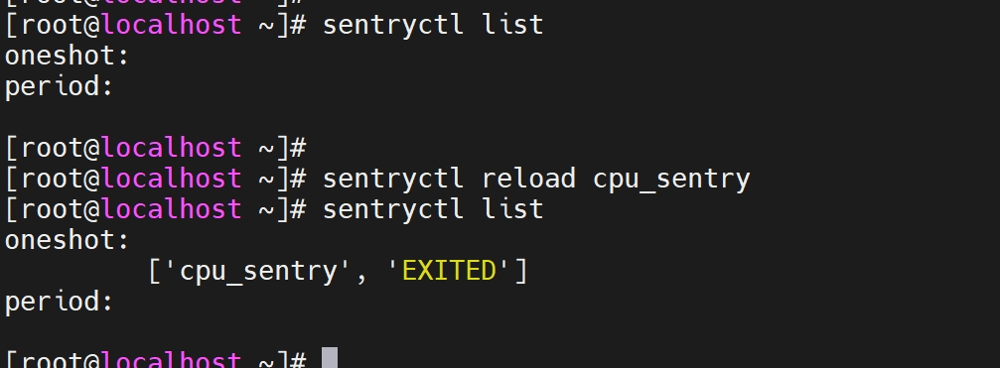
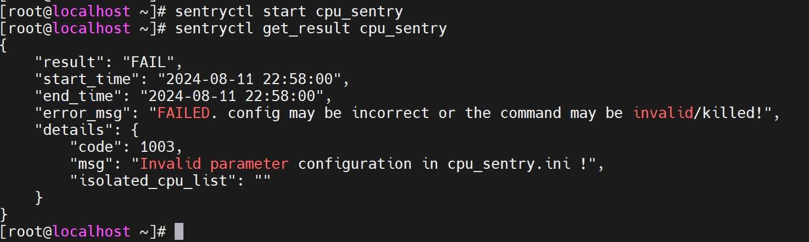
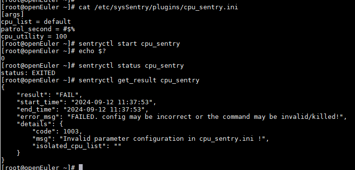
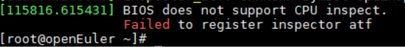

# CPU Fault Inspection Plugin

## Hardware Specifications

- Only the AArch64 architecture is supported.

## Installing the Plugin

### Prerequisites

The `sysSentry` inspection framework has been installed by referring to [Installation and Usage](./installation_and_usage.md).

### Installing the Software Package

```sh
yum install cpu_sentry ipmitool libxalarm -y
```

### Loading the Kernel Module

```sh
modprobe cpu_inspect
modprobe inspector-atf
```

## CPU Inspection Parameters

The configuration of CPU fault inspection tasks is stored in `/etc/sysSentry/plugins/cpu_sentry.ini`.

- Configuration item description

| Parameter | Default Value | Value Range                   | Description                     |
| ------------- | ------- | --------------------------- | ------------------------------- |
| cpu_list      | default | List of CPU core IDs in the test environment.        | List of CPUs for fault inspection.          |
| patrol_second | 60      | An integer greater than 0.                | Inspection timeout interval, in seconds.          |
| cpu_utility   | 100     | An integer ranging from 1 to 100.| Maximum CPU utilization allowed for the inspection program.|

- Configuration example

```ini
[args]
cpu_list = default
patrol_second = 60
cpu_utility = 100
```

## Loading a CPU Inspection Task

Before starting a CPU inspection task, you need to load the task. Run the `sentryctl reload cpu_sentry` command to load the CPU inspection task.


## Starting the CPU Inspection Task

Run the `sentryctl start cpu_sentry` command to start the CPU inspection task.

## Checking the CPU Inspection Status

Run the `sentryctl status cpu_sentry` command to check the status of the CPU inspection task.

## Stopping the CPU Inspection Task

Run the `sentryctl stop cpu_sentry` command to stop the running CPU inspection task.

## Viewing the CPU Inspection Result

Run the `sentryctl get_result cpu_sentry` command to obtain the inspection result. For details about the command output, see the description of `get_result`. The details are as follows:

```json
{
    ... ...
    "details": {
        "code":0,
        "msg":"xxx",
        "isolated_cpulist":"xxx"
    }
}
```

The fields in the details are described as follows:

| Key              | Description                                                        |
| ---------------- | ------------------------------------------------------------ |
| code             | Error code returned by the CPU inspection task. The value is an integer. The error codes and possible causes are as follows:<br>  `0`: No problem is found on all CPUs.<br>  `1001`: CPU 0 is faulty and cannot be isolated.<br>  `1002`: Some CPUs are faulty, and the faulty cores are successfully isolated.<br>  `1003`: The configuration parameters are invalid.<br>  `1004`: An error occurs during the execution of the inspection program.<br>  `1005`: The inspection program is killed.|
| msg              | Error description, which is a character string.                                        |
| isolated_cpulist | Faulty core isolation list, which is a character string. Example: `10-13,15-18`.                 |

Assume `patrol_second` is set to `-1`. Start the inspection task, the following result will be displayed:


## Viewing CPU Inspection Logs

The logs for CPU inspection tasks are recorded in the `/var/log/sysSentry/cpu_sentry.log` file. These logs primarily record error information; for example, if an illegal parameter value is configured in the configuration file, the following log content will be generated:

```sh
[root@localhost ~]# cat /var/log/sysSentry/cpu_sentry.log
ERROR:root:config 'cpu_list' (value [1--3]) is invalid in cpu_sentry.ini !
[root@localhost ~]#
```

## FAQs

- When the `sentryctl start cpu_sentry` command is called with invalid parameters are configured, the CPU inspection is not executed, but the command returns an exit status of `0`, indicating a success. Is this normal? Why?

  The `sentryctl` command is used to manage inspection tasks, and its exit status is independent of the execution status of the inspection task itself. The `sentryctl` process and the inspection task process execute asynchronously and do not affect each other. Running `sentryctl start cpu_sentry` delivers the CPU inspection task. An exit status of `0` means the task was successfully delivered, but it does not guarantee that the CPU inspection task executed successfully. Before performing the CPU fault inspection, the task validates whether the configuration parameters are valid. If there are invalid parameters in the configuration file, the inspection task will exit immediately. The result will be reflected in the task's execution results, which can be retrieved by running `sentryctl get_result cpu_sentry`, as shown in the figure below: 
  

- Why does error `Operation not supported` occur when failing to insert the `inspector-atf` module?

  This is because the current BIOS version does not support CPU fault inspection. You can find relevant information in the `dmesg` logs, for example:



- Why does the difference between `end_time` and `start_time` in the inspection results exceed 1 second?

  Only one CPU inspection task is allowed to run at a time. Therefore, before launching a CPU inspection task, the `pgrep` command is called to detect whether a CPU inspection process is already running in the environment. The time taken by the `pgrep` command varies across different environments. The duration reflected in `end_time - start_time` is primarily the execution time of the `pgrep` command.
