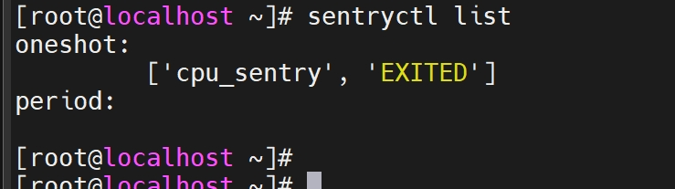

# Installing sysSentry

## OS

Current openEuler version.

## Environment Setup

- Install the OS corresponding to the current openEuler version. For details, see [Installation Guide](https://docs.openeuler.org/en/docs/24.03_LTS_SP3/server/installation_upgrade/installation/installation_guide.html).

- The root permission is required for installing `sysSentry`.

## Configuring a Yum Source

Create a `.repo` file in `/etc/yum.repos.d/` (for example, `/etc/yum.repos.d/openEuler.repo`). Then, open it with an editor and add the following content:

`AArch64 architecture:`

```conf
[openEuler-{version}]
name=openEuler-{version}
baseurl=http://repo.openeuler.org/openEuler-{version}/everything/aarch64/
enabled=1
gpgcheck=1
gpgkey=http://repo.openeuler.org/openEuler-{version}/everything/aarch64/RPM-GPG-KEY-openEuler

[openEuler-{version}-update]
name=openEuler-{version}-update
baseurl=http://repo.openeuler.org/openEuler-{version}/update/aarch64/
enabled=1
gpgcheck=0
```

**x86_64 architecture:**

```conf
[openEuler-{version}]
name=openEuler-{version}
baseurl=http://repo.openeuler.org/openEuler-{version}/everything/x86_64/
enabled=1
gpgcheck=1
gpgkey=http://repo.openeuler.org/openEuler-{version}/everything/x86_64/RPM-GPG-KEY-openEuler

[openEuler-{version}-update]
name=openEuler-{version}-update
baseurl=http://repo.openeuler.org/openEuler-{version}/update/x86_64/
enabled=1
gpgcheck=0
```

## Installing sysSentry

```sh
yum install sysSentry libxalarm -y
```

# Using sysSentry

## Starting the Inspection Framework

```sh
systemctl start sysSentry
systemctl start xalarmd
# After the command is executed successfully, you can run the status command to check whether the status is running.
systemctl status sysSentry
systemctl status xalarmd
```

## Configuring an Inspection Task

The `sysSentry` inspection framework manages inspection tasks in the form of inspection modules. Each module is defined by a corresponding `.mod` configuration file in the `/etc/sysSentry/tasks/` directory. The name of the inspection module is the same as the name of its `.mod` file, which is used to configure the running parameters of the inspection task.

## Managing Inspection Tasks

- Start a specified inspection task.

```sh
sentryctl start <module_name>
```

- Stop a specified inspection task.

```sh
sentryctl stop <module_name>
```

- List all loaded inspection tasks and their status.

```sh
sentryctl list
```

Example:



- Query the status of a specified inspection task.

```sh
sentryctl status <module_name>
```

Inspection status output:

| Status| Description|
| --- | --- |
| RUNNING | The inspection task is running. |
| WAITING | This status is exclusive to `period` inspection tasks, indicating that the `period` inspection task is waiting to be scheduled for its next execution. |
| EXITED | The inspection task has not yet started, or a `oneshot` inspection task has been executed and is in this status.|
| FAILED | The inspection task fails to start, or does not exit normally.|

- Reload the configuration of a specified task.

```sh
sentryctl reload <module_name>
```

- Query the inspection result of a specified inspection task.

```sh
sentryctl get_result <module_name>
```

The command output is in JSON format. The content format is as follows:

```json
{
    "result": "xxx",
    "start_time": "YY-mm-DD HH:MM:SS",
    "end_time": "YY-mm-DD HH:MM:SS",
    "error_msg" : "xxx",
    "details":{} #The details information varies according to the inspection task. The specific information is provided by the corresponding inspection module.
}
```

The mapping between `result` and `error_msg` is as follows:

| result | Corresponding error_msg Information |
| --- | --- |
| PASS | "" |
| SKIP | "not supported.maybe some rpm package not be installed." |
| FAIL | "FAILED. config may be incorrect or the command may be invalid/killed!" |
| MINOR_ALM |"the command output shows that the status is 'INFO' or 'GENERAL_WARN'."  |
| MAJOR_ALM | "the command output shows that the status is 'WARN' or 'IMPORTANT_WARN'." |
| CRITICAL_ALM | "the command output shows that the status is 'FAIL' or 'EMERGENCY_WARN'." |

# FAQs

- If the `sysSentry` service is started and stopped frequently within a short period, error message `RuntimeError: reentrant call inside <_io.BufferedWriter name='</var/run/sysSentry/sysSentry.pid>'>` appears in the startup logs. Does this affect the functionality?

    Starting the `sysSentry` service and then stopping it within a short period causes a termination signal to be received before the `sysSentry` initialization process has finished, which may trigger the `sig_handler` flow twice. If the first flow happens to be executing `close()` when the second `sig_handler` flow is triggered, a `RuntimeError` will be raised. This issue does not affect normal functionality. It is recommended that users do not immediately stop the `sysSentry` service after starting it.
