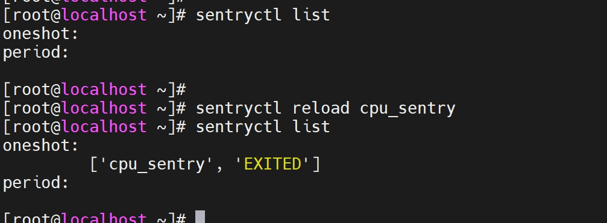
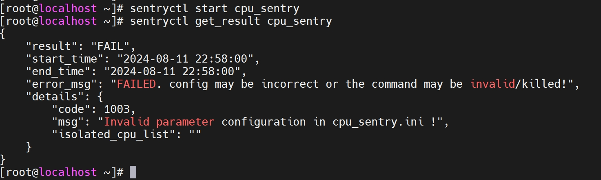
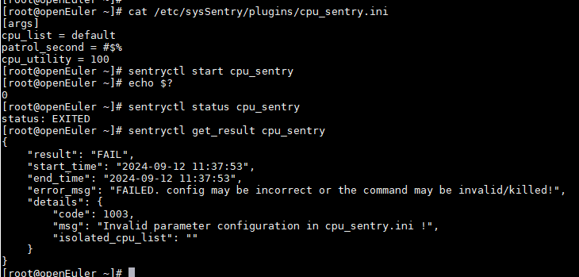
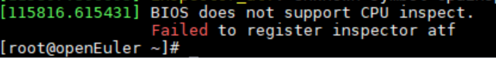

# CPU故障巡检插件

## 硬件规格要求

- 仅支持aarch64架构

## 安装插件

### 前置条件

已通过《[安装和使用](./installation_and_usage.md)》安装sysSentry巡检框架。

### 安装软件包

```sh
yum install cpu_sentry ipmitool libxalarm -y
```

### 加载内核模块

```sh
modprobe cpu_inspect
modprobe inspector-atf
```

## CPU巡检参数配置

cpu故障巡检任务的配置保存在/etc/sysSentry/plugins/cpu_sentry.ini中。

- 配置项说明

| 插件配置参数  | 默认值  | 取值范围                    | 配置项说明                      |
| ------------- | ------- | --------------------------- | ------------------------------- |
| cpu_list      | default | 测试环境CPU核ID列表         | 进行故障巡检的CPU列表           |
| patrol_second | 60      | 大于0的整数                 | 巡检超时时间，单位：s           |
| cpu_utility   | 100     | 1-100之间的整数（含1和100） | 允许巡检程序运行的CPU最大利用率 |

- 配置示例

```ini
[args]
cpu_list = default
patrol_second = 60
cpu_utility = 100
```

## 加载CPU巡检任务

启动CPU巡检任务之前，需要先加载CPU巡检任务。执行 `sentryctl reload cpu_sentry` 加载CPU巡检任务。


## 启动CPU巡检任务

执行 `sentryctl start cpu_sentry` 启动CPU巡检任务。

## 查看CPU巡检状态

执行 `sentryctl status cpu_sentry` 查看CPU巡检任务状态。

## 停止CPU巡检任务

执行 `sentryctl stop cpu_sentry` 停止正在运行的CPU巡检任务。

## 查看CPU巡检结果

巡检结果获取命令：`sentryctl get_result cpu_sentry`， 命令回显信息参考get_result接口说明，details信息如下：

```json
{
    ... ...
    "details": {
        "code":0,
        "msg":"xxx",
        "isolated_cpulist":"xxx"
    }
}
```

details各个字段含义如下：

| key              | 含义                                                         |
| ---------------- | ------------------------------------------------------------ |
| code             | cpu巡检任务返回错误码，整型。错误码及可能的原因如下：<br>  0：所有CPU未发现问题  <br>  1001：0号CPU有问题，无法隔离  <br>  1002： 部分CPU有问题，故障核隔离成功  <br>  1003：无效的配置参数  <br>  1004：巡检程序执行出错  <br>  1005：巡检程序被杀死 |
| msg              | 字符串，错误描述信息                                         |
| isolated_cpulist | 字符串，故障隔离核列表，例如："10-13,15-18"                  |

比如配置patrol_second值为-1，启动巡检任务，得到结果如下：


## 查看CPU巡检日志

CPU巡检任务的日志记录在 /var/log/sysSentry/cpu_sentry.log 文件中，主要记录错误信息，比如配置文件中配置非法的参数值，会得到如下的日志内容：

```sh
[root@localhost ~]# cat /var/log/sysSentry/cpu_sentry.log
ERROR:root:config 'cpu_list' (value [1--3]) is invalid in cpu_sentry.ini !
[root@localhost ~]#
```

## 常见问题Q&A

- 在配置无效参数时，调用`sentryctl start cpu_sentry`命令，未执行cpu巡检，但是该命令的退出状态为0，说明命令执行成功。这是否正常，为什么？

  sentryctl命令用于管理巡检任务，它的退出状态与巡检任务执行的执行状态无关。sentryctl进程与巡检任务进程是异步执行的，互不影响。用户执行`sentryctl start cpu_sentry`是下发cpu巡检任务，该命令退出状态为0表示任务下发成功，但是不能说明CPU巡检任务执行成功。在执行CPU故障巡检之前，巡检任务会检测任务配置参数是否合法。如果CPU巡检任务配置文件中有非法参数，巡检任务会直接退出，检查结果体现在巡检任务执行结果中，我们可以执行`sentryctl get_result cpu_sentry`获取巡检任务执行结果，如下图所示：  
  

- 插入inspector-atf模块失败，提示`Operation not supported`，这是为什么？

  这是因为当前BIOS版本不支持CPU故障巡检，查看dmesg日志可以得到相关日志信息，比如：



- 巡检结果中的end_time - start_time 的差值会超过1s，这是为什么？

  CPU巡检只允许同时运行一个任务，因此在拉起CPU巡检任务之前会调用pgrep命令检测测试环境中是否有已经运行的CPU巡检进程，而不同环境中pgrep命令耗时有差异，end_time - start_time 的超时时间主要为pgrep命令的耗时。
