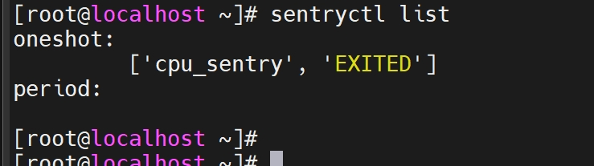

# 安装sysSentry

## 操作系统

openEuler 当前版本

## 环境准备

- 安装openEuler 当前版本对应的系统，安装方法参考 《[安装指南](https://docs.openeuler.openatom.cn/zh/docs/24.03_LTS_SP2/server/installation_upgrade/installation/installation_on_servers.html)》。

- 安装sysSentry需要使用root权限。

## 配置yum源

在/etc/yum.repos.d/创建.repo文件（eg. /etc/yum.repos.d/openEuler.repo），使用编辑器打开.repo文件添加如下内容：

**aarch64架构：**

```conf
[openEuler-{version}]
name=openEuler-{version}
baseurl=http://repo.openeuler.org/openEuler-{version}/everything/aarch64/
enabled=1
gpgcheck=1
gpgkey=http://repo.openeuler.org/openEuler-{version}/everything/aarch64/RPM-GPG-KEY-openEuler

[openEuler-{version}-update]
name=openEuler-{version}-update
baseurl=http://repo.openeuler.org/openEuler-{version}/update/aarch64/
enabled=1
gpgcheck=0
```

**x86_64架构：**

```conf
[openEuler-{version}]
name=openEuler-{version}
baseurl=http://repo.openeuler.org/openEuler-{version}/everything/x86_64/
enabled=1
gpgcheck=1
gpgkey=http://repo.openeuler.org/openEuler-{version}/everything/x86_64/RPM-GPG-KEY-openEuler

[openEuler-{version}-update]
name=openEuler-{version}-update
baseurl=http://repo.openeuler.org/openEuler-{version}/update/x86_64/
enabled=1
gpgcheck=0
```

## 安装sysSentry

```sh
yum install sysSentry libxalarm -y
```

# 使用sysSentry

## 启动巡检框架

```sh
systemctl start sysSentry
systemctl start xalarmd
# 执行成功后可通过status命令查看状态为running
systemctl status sysSentry
systemctl status xalarmd
```

## 配置巡检任务

sysSentry巡检框架以巡检模块（module）的形式管理巡检任务，每个巡检模块由/etc/sysSentry/tasks/目录下对应的.mod配置文件定义，巡检模块的名称即为.mod文件的名称，.mod配置文件用于配置巡检任务的运行参数。

## 管理巡检任务

- 启动指定巡检任务

```sh
sentryctl start <module_name>
```

- 终止指定巡检任务

```sh
sentryctl stop <module_name>
```

- 列出所有已加载的巡检任务及状态

```sh
sentryctl list
```

例如：



- 查询指定巡检任务的状态

```sh
sentryctl status <module_name>
```

巡检状态回显信息：

| 状态 | 描述 |
| --- | --- |
| RUNNING | 巡检任务正在运行  |
| WAITING | 仅period类型巡检任务可设置此状态，表示period巡检任务等待下一次被调度执行  |
| EXITED | 巡检任务尚未执行，或者oneshot类型的巡检任务执行结束处于此状态 |
| FAILED | 巡检任务未拉起成功，或者巡检任务未正常退出 |

- 重载指定任务配置

```sh
sentryctl reload <module_name>
```

- 查询指定巡检任务的巡检结果

```sh
sentryctl get_result <module_name>
```

回显信息格式为json格式，内容格式如下：

```json
{
    "result": "xxx",
    "start_time": "YY-mm-DD HH:MM:SS",
    "end_time": "YY-mm-DD HH:MM:SS",
    "error_msg" : "xxx",
    "details":{}  # detail信息因巡检任务不同而不同，具体信息由巡检模块提供
}
```

"result"和"error_msg"对应关系如下：

| result | 对应error_msg信息  |
| --- | --- |
| PASS | "" |
| SKIP | "not supported.maybe some rpm package not be installed." |
| FAIL | "FAILED. config may be incorrect or the command may be invalid/killed!" |
| MINOR_ALM |"the command output shows that the status is 'INFO' or 'GENERAL_WARN'."  |
| MAJOR_ALM | "the command output shows that the status is 'WARN' or 'IMPORTANT_WARN'." |
| CRITICAL_ALM | "the command output shows that the status is 'FAIL' or 'EMERGENCY_WARN'." |

# 常见问题Q&A

- 短时间内频繁启动并关闭sysSentry服务，查看服务启动日志会出现`RuntimeError: reentrant call inside <_io.BufferedWriter name='</var/run/sysSentry/sysSentry.pid>'>` 错误信息，这对功能是否受影响？

    启动sysSentry服务又短时间内停止sysSentry服务导致sysSentry初始化流程未结束就接收到终止信号，可能会触发两次sig_handler流程。如果第一次流程正好执行到close()的时候触发了第二次sig_handler流程，这就会引发RuntimeError。该问题不影响正常功能，建议用户启动sysSentry服务后不要立即关闭sysSentry服务。
