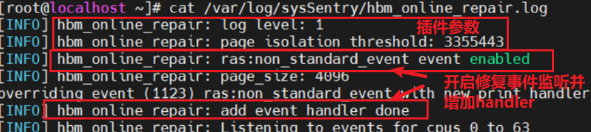

# HBM ACLS/SPPR 在线修复插件

## 简介

该插件用于保障业务可靠性，维护业务的连续运行。具体为针对业务运行时的CE故障诊断或预测结果，采用ACLS/SPPR进行故障地址/故障行进行在线修复，避免UCE导致业务中断。整个流程涉及到FW、IMU、BIOS、OS、BMC等多方面的整体能力，该插件为OS端使能插件，主要功能为监听接受ACLS/SPPR消息、持久化保存故障信息与在线修复故障。

## 硬件规格要求

- 仅支持aarch64架构
- 仅支持华为服务器，且服务器中装载HaiyanHBM设备
- FW需要具有将故障行列地址解析为物理地址并通知OS的能力，需要相应固件支持
- IMU/BIOS需要有透传FW下发给OS在线修复请求的能力，需要相应固件支持
- BMC需要有接收在线修复请求并返回接受结果的能力，需要相应固件支持

## 安装插件

### 前置条件

已通过《[安装和使用](./installation_and_usage.md)》安装sysSentry巡检框架。

### 安装软件包

```shell
yum install hbm_online_repair -y
```

## 在线修复插件参数配置

在线修复插件的配置文件默认保存在/etc/sysconfig/hbm_online_repair.env中。

- 配置项说明

| 配置项                      | 默认值  | 取值范围           | 必选项 | 含义                                                         |
| --------------------------- | ------- | ------------------ | ------ | ------------------------------------------------------------ |
| HBM_ONLINE_REPAIR_LOG_LEVEL | 1       | 0~3的整数          | Y      | 在线修复插件日志级别，可设置等级有0（DEBUG）、1（INFO）、2（WARNING）、3（ERROR），当设置为低级别时，高级别等级日志也会打印 |
| PAGE_ISOLATION_THRESHOLD    | 3355443 | 0~2147483647的整数 | Y      | 系统隔离资源的阈值，单位为KB。插件的在线修复功能需要先对页面进行隔离，会占用系统的隔离资源，当系统整体的隔离资源超过该阈值时，插件将不会进行隔离以及后续的修复、上线操作 |

- 配置示例

```ini
HBM_ONLINE_REPAIR_LOG_LEVEL=1
PAGE_ISOLATION_THRESHOLD=3355443
```

## 管理在线修复插件

管理插件方式与《[安装和使用](./installation_and_usage.md)》方式基本相同，不在此赘述。

注意，插件在使用`sentryctl get_result <module_name>`方法时，该方法只会返回插件的运行起止时间`"start_time"`与`"end_time"`，其余字段为空，需要通过读取日志的方式获取插件的运行状态及相关信息。

## 查看在线修复插件日志

在线修复插件日志记录在 /var/log/sysSentry/hbm_online_repair.log 文件中，日志中主要记录插件的初始配置以及收到消息后的各种处理结果。

### 启动日志

插件启动后，一般会有如下日志：



### 运行日志

插件在接收到正确的ACLS/SPPR类型的故障上报后，会出现`Received ACLS/SPPR repair request`字样，然后插件按照两个阶段处理信息并执行操作，日志中会打印对应操作的信息，如下图示例：


#### 阶段一：持久化保存信息

该阶段的日志会出现两种情况：

1. 出现`write hbm fault info to flash xxx success`表示持久化信息保存成功；
2. 出现其余信息，表示持久化信息保存失败，可对照下表查询失败原因：

| 报错信息                                                     | 含义                                      |
| ------------------------------------------------------------ | ----------------------------------------- |
| fault info storage reach threshold, cannot save new record into flash | 持久化信息保存大小超过了阈值（默认128KB） |
| invalid fault info                                           | 解析出的持久化信息格式错误                |
| read variable xx-xx attribute failed, stop writing           | 对应guid位置的efivar属性读取错误          |
| write to xx-xx failed                                        | 持久化信息写入失败                        |

#### 阶段二：Flat模式下尝试进行修复

由BIOS透传至OS的ACLS/SPPR故障上报信息会有两种模式：Flat模式与Cache模式。只有接收到Flat模式的消息，插件才会尝试进行修复操作，因此该阶段会有三种情况的日志出现：

1. 无任何打印，说明消息模式为Cache模式，此时插件只会进行持久化信息保存（阶段一）而不会尝试修复操作。
2. 出现`HBM ACLS/SPPR: Page xxx repair and online success`字样，表示接收到了Flat模式信息且修复成功；
3. 出现其他信息，表示接收到了Flat模式消息并执行操作，在隔离/修复/上线中任一操作失败，可对照下表查询失败原因：

| 报错信息                                                  | 含义                                         |
| --------------------------------------------------------- | -------------------------------------------- |
| Page isolate failed: Get hardware_corrupted_size failed   | 无法读取当前系统的隔离资源使用情况，隔离失败 |
| Page isolate failed: the isolation resource is not enough | 系统隔离资源超阈值，隔离失败                 |
| HBM: ACLS/SPPR offline failed, address is xxx             | ACLS/SPPR调用隔离接口，返回失败              |
| Repair driver is not loaded, skip error                   | 未找到修复相关的驱动，修复失败               |
| No HBM device memory type found, skip error               | 没有找到HBM设备，修复失败                    |
| Err addr is not in device, skip error                     | 地址不在任何一个HBM设备中，修复失败          |
| HBM: Address xxx is not supported to ACLS/SPPR repair     | 该地址不支持ACLS/SPPR修复，修复失败          |
| HBM ACLS/SPPR: Page xxx online failed                     | 页面上线失败                                 |
