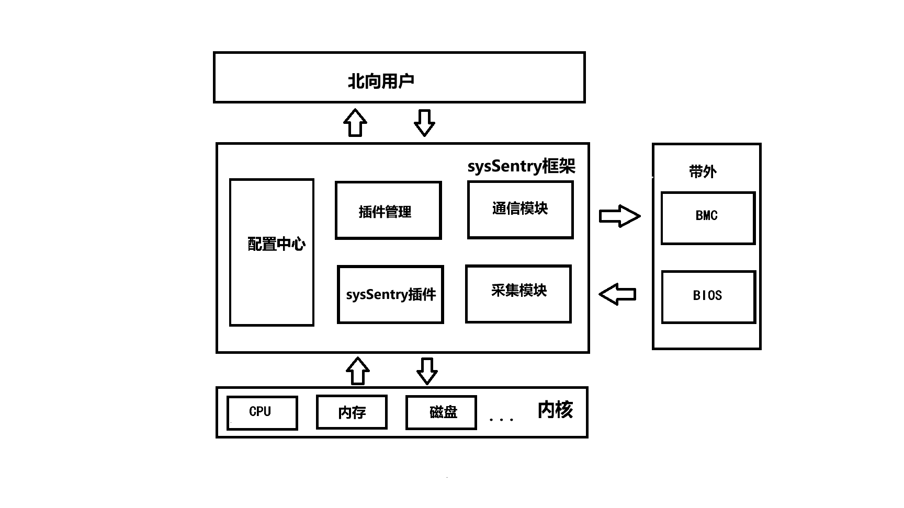

# sysSentry简介

 sysSentry主要提供故障巡检框架，该框架通过提供统一的北向故障上报接口以及南向提供支持不同巡检/诊断能力的插件，支持对系统中CPU、内存、磁盘、NPU等硬件故障进行巡检和诊断。
 

   sysSentry功能设计如下：

1. 统一告警/事件通知服务：通过提供一个统一的告警服务，接收各个插件上报的故障信息，并由该通知服务进行统一转发，各个业务订阅服务可以根据需要进行不同故障的消息订阅。
2. 统一日志服务：通过提供统一的日志服务，支持各个插件的故障信息进行汇总记录，提升问题定位效率。
3. 故障诊断/巡检框架：该框架支持以插件化的方式进行各项巡检任务以及诊断任务的开发和配置，不同插件支持独立启动、停止、状态查询、结果查询以及启动方式设置，并且支持C/C++、Python、Shell等不同编程语言的插件。
4. 轻量级数据采集服务：该服务支持通过内核接口、BIOS、BMC等接口，查询硬件的各个状态信息，供各个插件进行分析和使用，并且支持适配底层不同的架构、版本以及数据采集服务。
